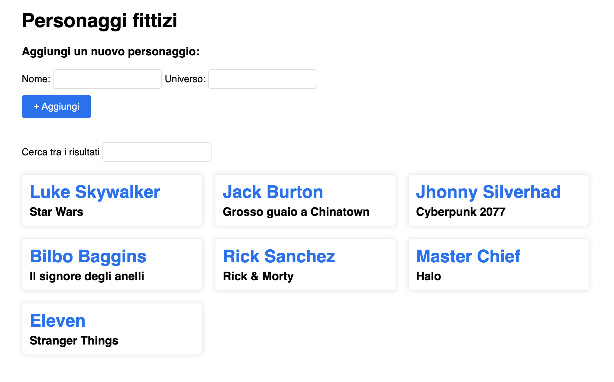

# Lezione del 18/03/2021

### File presenti

- `index.html` - wrapper esempio moduli
- `a.js`, `b.js`, `c.js` - esempi ES modules
- `ex1.html` - soluzione del primo esercizio della lezione precedente

[https://developer.mozilla.org/en-US/docs/Web/JavaScript/Guide/Modules](https://developer.mozilla.org/en-US/docs/Web/JavaScript/Guide/Modules)

### Esercizio

Dato il seguente array:

```javascript
const people = [
  "Luke Skywalker - Star Wars",
  "Jack Burton - Grosso guaio a Chinatown",
  "Jhonny Silverhad - Cyberpunk 2077",
  "Bilbo Baggins - Il signore degli anelli",
  "Rick Sanchez - Rick & Morty",
  "Master Chief - Halo",
  "Eleven - Stranger Things",
];
```

Realizzare una piccola web app per visualizzare delle card con i nomi del personaggi e l'universo di appartenenza stilati in maniera differente.

**Requisiti:**

- visualizzazione dati iniziale
- filtrare i dati nella lista utilizzando una ricerca testuale
- possibilità di aggiungere un nuovo elemento tramite due campi di testo (_nome e universo_)
- stilare gli elementi in lista per trasformarli in "cards"

**Screenshot:**


**Riferimenti MDN:**

- `template literals` - [https://developer.mozilla.org/en-US/docs/Web/JavaScript/Reference/Template_literals](https://developer.mozilla.org/en-US/docs/Web/JavaScript/Reference/Template_literals)
- `.push()` - [https://developer.mozilla.org/en-US/docs/Web/JavaScript/Reference/Global_Objects/Array/push](https://developer.mozilla.org/en-US/docs/Web/JavaScript/Reference/Global_Objects/Array/push)
- `.split()` - [https://developer.mozilla.org/en-US/docs/Web/JavaScript/Reference/Global_Objects/String/split](https://developer.mozilla.org/en-US/docs/Web/JavaScript/Reference/Global_Objects/String/split)
- `.map()` - [https://developer.mozilla.org/en-US/docs/Web/JavaScript/Reference/Global_Objects/Array/map](https://developer.mozilla.org/en-US/docs/Web/JavaScript/Reference/Global_Objects/Array/map)
- `.filter()` - [https://developer.mozilla.org/en-US/docs/Web/JavaScript/Reference/Global_Objects/Array/filter](https://developer.mozilla.org/en-US/docs/Web/JavaScript/Reference/Global_Objects/Array/filter)
